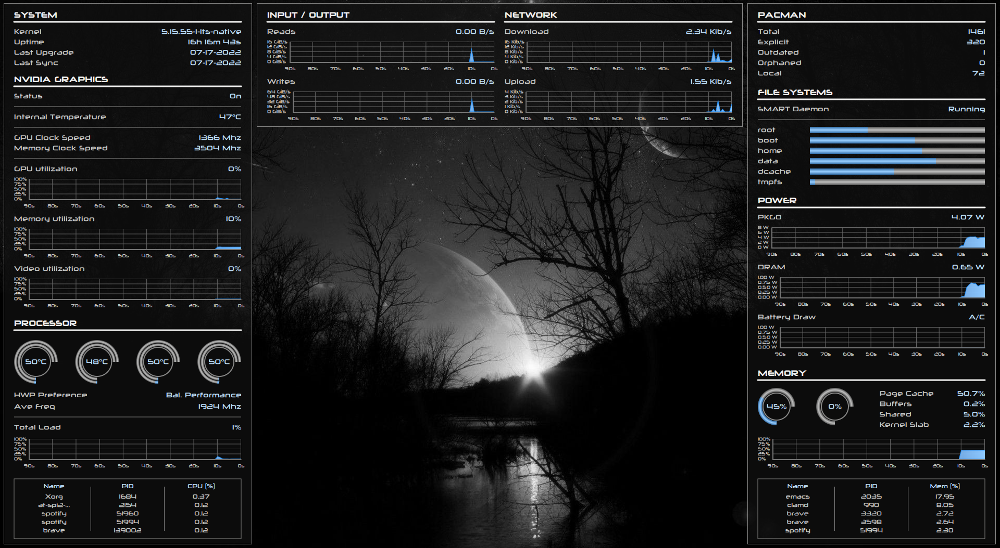

# Universal Conky

A conky configuration that can be easily adapted for multiple machines.

# Features

Due to me needing to use this on multiple machines with annoyingly different
hardware, I designed this to be as modular as possible.

The configuration is accomplished via one yaml file which encodeds the theme,
refresh rate, interface geometry, hardware queried, etc.

The interface is broken apart into different 'modules' that can be arranged on
the screen as desired, and the lua code is optimized to pre-compute as much as
possible in the startup hook so that the main loop runs efficiently.

Everything is drawn with Lua/Cairo, because I think it's pretty :)

# Gallery

Advanced layout



Minimal layout


# Dependencies

Requires conky with Lua bindings and cairo support enabled

The following packages are required regardless of which modules are enabled:
* libyaml
* yajsv

The following packages are required for installation:
* luarocks

# Installation

Clone this repo and install the required rocks. It is recommended to install it
to your home config directory.

```
git clone https://github/ndwarshuis/universal-conky ~/.config/conky
cd ~/.config/conky
./install_rocks
```

Note, `libyaml` needs to be installed or else the `lyaml` rock will not compile.

# Modules

## Filesystem

Displays usage of all filesystems. Also shows if the smart daemon is running,
which might just save your data/butt (but not your disks, because nothing can
save your disks from death).

## Graphics

Displays nerdy stats pertaining to the nvidia card (clock speeds, utilization,
and temperature). In addition to having an nvidia card, also required
`nvidia-settings` to be installed.

## Memory

Shows memory and swap usage, optionally broken down by cache, buffers, shared,
and kernel slab. Also shows a top-like table of processes ranked by memory
usage.

## Network

Display history of network throughput (down and up). It offers a nice incentive
to upgrade to gigabit ethernet.

## Pacman

Displays current counts of pacman packages broken down by type.

Since quering the pacman database is slow, this is done exteranlly with a script
(see [scripts](scripts/pacman_stats)). The recommended way to run this is via a
systemd user timer.

## Power

Displays power consumption for the Intel RAPL interface (requires the
`CONFIG_INTEL_RAPL` kernel option to be enabled at compile time). Also shows
battery power consumption for laptops.

## Processor

Displays CPU utilization, frequency, and the current HWP setting.

It also can display individual core/thread utilization/temperature, which gives
a nice ego boost in cases where this is used on a 16-core machine :) Finally, it
can display a top-like table processes ranked by CPU usage.

Note, this module is ironically quite slow (relative to the others),
particularly in the case of quering the frequency.

## Read/Write

Displays history of read/write loads to one or more disks. It currently shows
the aggregate of all desired disks and does not distinguish individual disks.

## System

Displays kernel version, uptime, and recent pacman activity. Obviously assumes
this is being run on Arch Linux and friends.

# Configuation

All configuration settings are specified in the [schema](config/schema.yml).

Brief overview of each section:

* bootstrap: options pertaining to setting conky variables
* modules: individual module configurations (most settings are toggle-able)
* layout: controls where modules go (note, if a module is listed here it needs
  to be in the `modules` section as well if applicable)
* theme: controls colors, fonts, and shapes of things

See [the default config](config/fallback.yml) for a simple example. A custom
config will be read if found at `~/.config/conky.yml`.

# Optimizations (for super-nerds)

Making this configuration efficient required some cute tricks. I had too much
fun figuring them out, but in case anyone else wants to skip said fun, here is
the TLDR. These conclusions were reached simply by timing the main loop with
`os.clock()`:

* usual Lua stuff: use locals, don't create/modify tables repeatedly, etc
* usual cairo stuff: clean up after yourself
* pre-draw static images: Rather than make cairo draw every pixel in every loop,
  divide each 'widget' into 'static' and 'dynamic' components, where the
  'static' components are drawn once and saved to a cairo surface. See [this
  file](src/compile.lua) for details.
* memoize dynamic images: For images that require lots of computation, cache
  them in a table. This works well for things like arcs where one number
  (preferrably an integer, not a float) can be mapped to a single image.
* use sysfs where possible: in some cases it is faster to read a 'file' than
  invoke a conky object
* use the startup hook: Most of the 'heavy' computation happens once in the
  startup hook. The startup function can accept arguments from `conky.conf`
  which makes it much more flexible. This has the nice benefit of enforcing
  separation of concerns.
* don't query the system more often than necessary: Not every widget needs to be
  updated in every loop. For things like filesystem usage (which don't change
  that much), querying the file systems every 10-30 seconds seems reasonable,
  and makes the rest of the interface snappier.
* run heavy stuff in asynchronous scripts: Some operations are so slow they will
  make the entire interface noticably lag (even when run less frequently than
  the update interval). For these, run a script using a systemd timer and save
  the output in tmpfs.
